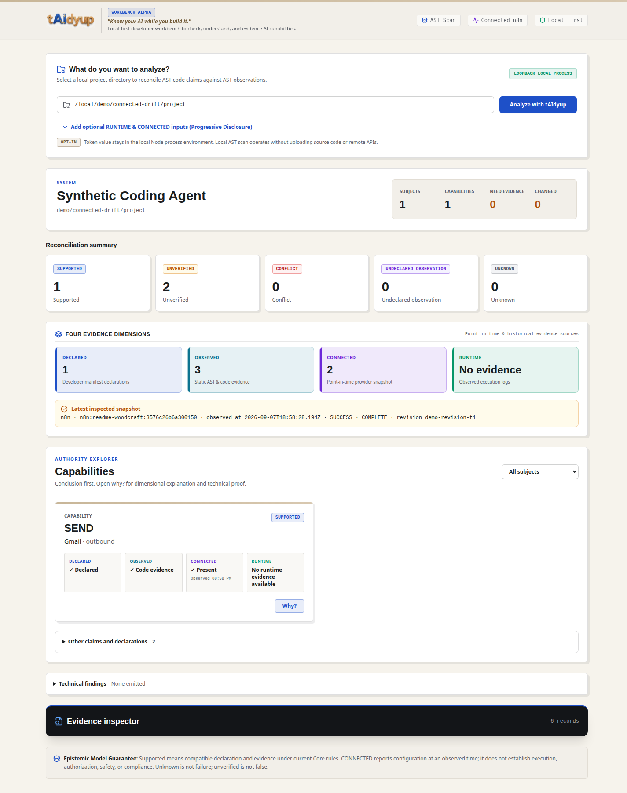

<div align="center">


# tAIdyup

### Know your AI while you build it.

**The local-first developer tool for understanding, checking and evidencing what your AI can actually do.**

[](https://www.npmjs.com/package/taidyup)
[](LICENSE)
[](package.json)

**Align what you declare with what you build.**

</div>

---

## What authority does your AI appear to have — and what evidence supports that?

An AI system can span source code, agents, tools, workflows, models, memory, MCP servers, and external configuration. Its apparent authority can change while the project still looks like the same application.

tAIdyup builds an evidence-backed map of what authority your AI appears to have—and shows exactly what supports that conclusion, what changed, what execution activity was observed, and what remains unknown:

- which subject or agent is involved;
- which capability is declared or observed;
- which resource and constraints apply;
- why a reconciliation result was reached;
- which evidence and provenance support it;
- what changed, and what remains unknown.

It does not turn configuration or runtime activity into certainty. It preserves the distance between intent, technical evidence, current connected state, observed runtime activity, and what remains unknown.

## See your AI, not just another report

Use the **graphical interface** to explore your AI: move from subjects and capabilities into reconciliation states, evidence, provenance, and **Why?** Use the **CLI and machine-readable outputs** to integrate tAIdyup into development workflows, automate analysis, generate evidence artifacts, compare reports, and inspect supported current n8n configuration.

For local analysis, the graphical interface and CLI share the same reconciliation semantics and Trust Kernel. The current Git-main graphical interface keeps DECLARED, OBSERVED, CONNECTED, and RUNTIME evidence distinct, and can explicitly inspect one supported n8n CONNECTED source or import a sanitized local RUNTIME artifact. Report diff, SARIF, and the Technical Passport remain CLI-only.

Run the current repository UI:

```bash
npm install
npm run build
npm run ui
```

Then open `http://127.0.0.1:3001`. Choose or enter any existing local project directory; a declaration manifest is optional.



_The current Git-main Woodcraft Workbench analyzing the repository's local synthetic demo fixture. `SUPPORTED` is an evidence-reconciliation state, not a claim of authorization, safety, or compliance._

## Check apparent authority dimension by dimension

A declaration is more than an action name. tAIdyup assesses the subject, predicate, action, resource, and declared constraints against relevant evidence.

Conceptual example:

| Claim or observation | Result | Why |
| --- | --- | --- |
| Declared `READ` repository | `SUPPORTED` | Every mandatory dimension has sufficient compatible evidence. |
| Declared `WRITE` files | `UNVERIFIED` | The available evidence does not establish every required binding, resource, or constraint dimension. |
| Declared `CANNOT EXECUTE` shell | `CONFLICT` | Bound evidence explicitly contradicts the prohibition. |
| Observed agent-bound `EXECUTE` shell | `UNDECLARED_OBSERVATION` | Sufficiently bound evidence supports the capability, but no compatible declaration covers it. |

This table illustrates the model; it is not a claim about a particular project.

`SUPPORTED` means the mandatory declaration dimensions are supported by compatible evidence. It does **not** mean verified identity, execution, authorization, safety, or compliance.

## Not everything found is proven

```text
DECLARED                 owner-reviewed intent
    +
OBSERVED                 local source code and supported workflow artifacts
    +
CONNECTED                explicit point-in-time current configuration
    +
RUNTIME                  explicit sanitized local lifecycle evidence
    ↓
Trust Kernel
    ↓
reconciled result
```

The boundaries matter:

- `DECLARED != VERIFIED`
- `OBSERVED != AUTHORIZED`
- `CONNECTED != AUTHORIZED`
- `IMPLEMENTED != ENABLED`
- `ENABLED != EXECUTED`
- `EXECUTED != AUTHORIZED`
- `AUTHORIZED != COMPLIANT`
- `SAME_WORKFLOW != AGENT_AUTHORITY`
- `STATIC_CONFIGURATION != RUNTIME_RESOURCE`
- `CONNECTED_AT_T != CURRENT_FOREVER`
- `RUNTIME_OBSERVED != UNIVERSALLY_EXECUTED`
- `NO_RUNTIME_EVIDENCE != NOT_EXECUTED`
- `EXECUTION_ATTEMPTED != EXECUTION_SUCCEEDED`
- `TOOL_SUCCEEDED != RESULT_CORRECT`

tAIdyup requires evidence for subject, capability, and resource relationships. Similar names or coexistence in a repository or workflow are not treated as identity or authority bindings.

## See configured-authority drift

The current CONNECTED V0 has been validated against a disposable n8n 2.37.10 instance and a synthetic workflow:

```text
T1
Declared SEND    ✓
Observed SEND    ✓
Connected SEND   ✓
→ SUPPORTED

        n8n configuration changes

T2
Declared SEND    ✓
Observed SEND    ✓
Connected SEND   absent
→ UNVERIFIED
→ CURRENT_STATE_DRIFT
```

At T1, the workflow revision reported an explicit AI Agent → Gmail tool relationship that mapped to configured `SEND`. After the Gmail tool was removed outside the collector, T2 also emitted `CONNECTED_ABSENCE_OBSERVED`; the earlier evidence remained in provenance.

tAIdyup established that the supported current configuration changed. It did **not** establish email execution, credential validity, authorization, or compliance. This is an explicit point-in-time comparison, not continuous monitoring.

Report diff is separate: `taidyup diff` compares two saved results. Neither a failed nor a partial CONNECTED retrieval is treated as evidence of absence.

## Try it

Requires Node.js 18+.

### Published npm Alpha 3 — CLI only

The published `taidyup@0.1.0-alpha.3` npm artifact is intentionally CLI-only: `init`, `scan`, `validate`, `report`, `diff`, explicit `connected-n8n`, and explicit `runtime-import`. It does not contain or launch the Woodcraft Workbench.

```bash
npm install -g taidyup@alpha
taidyup --help
```

### Repository/local development UI — Woodcraft Workbench

The Woodcraft Workbench, native folder-picker bridge, bundled onboarding demo, guided tour, and local UI are repository capabilities:

```bash
git clone https://github.com/AnarQorp/taidyup.git
cd taidyup
npm install
npm run build
npm run ui
```

Open `http://127.0.0.1:3001`, choose a folder or enter an absolute local path, then analyze. The bundled demo teaches the interface using versioned synthetic local evidence; it does not connect to a provider or execute a workflow.

### CLI quick start — inspect first, declare later

```bash
taidyup scan ./your-ai-project
taidyup validate ./your-ai-project
taidyup report ./your-ai-project
taidyup diff previous-report.json current-report.json
```

No `taidyup.json` is required for these inspections. With no declaration source, `declarationContext` is `ABSENT`: tAIdyup can report supported technical observations but cannot infer intended authority.

Declarations are optional additional reconciliation context. To adopt one later, run `taidyup init ./your-ai-project`, review and explicitly complete the generated non-declarative `taidyup.json.draft`, then run `taidyup init ./your-ai-project --accept`. Scanner suggestions are never promoted into owner declarations automatically. Alpha 3 supports JSON declarations in `taidyup.json`; real YAML parsing is not supported.

## Explicit CONNECTED n8n inspection

The current repository provides an opt-in `connected-n8n` command for one explicitly selected workflow:

```bash
export N8N_API_KEY='your-api-key'

node bin/taidyup.js connected-n8n \
  --base-url https://your-n8n.example \
  --workflow WORKFLOW_ID \
  --connection-id my-n8n \
  --token-env N8N_API_KEY \
  --authority-mode UNKNOWN \
  --observed-artifact ./workflow.json \
  --manifest ./taidyup.json
```

Before retrieval, the CLI discloses the provider, target origin, GET endpoint classes, reported authority mode, and `execution=false`.

CONNECTED V0:

- is disabled unless this explicit command is used;
- connects directly from the developer's machine—there is no tAIdyup cloud proxy;
- uses bounded workflow-list and exact-workflow `GET` requests;
- rejects redirects and mutating HTTP methods;
- reads the token only from the named environment variable;
- sanitizes current configuration and reconciles it locally;
- does not call credential or execution endpoints;
- does not validate credentials, infer authorization, execute workflows, poll, or monitor.

A client that only sends `GET` is not necessarily using a technically read-only credential. tAIdyup reports `TECHNICALLY_READ_ONLY` only when provider evidence establishes that property; otherwise the effective mode remains client-enforced or unknown.

## The five reconciliation states

| State | Meaning |
| --- | --- |
| **`SUPPORTED`** | Every mandatory claim dimension has sufficient compatible evidence. Review the provenance; this is not authorization or certification. |
| **`UNVERIFIED`** | One or more mandatory dimensions lack sufficient evidence. The declaration is not thereby false. |
| **`CONFLICT`** | Relevant bound evidence explicitly contradicts a declared dimension or prohibition. |
| **`UNDECLARED_OBSERVATION`** | A sufficiently bound observed capability is not covered by a declaration. |
| **`UNKNOWN`** | The available evidence is ambiguous, unsupported, incomplete, or outside current coverage. Uncertainty is preserved rather than guessed away. |

## Evidence sources currently supported

### Source code

Selective static detection and structural binding for supported patterns in LangChain/LangGraph (Python and TypeScript), CrewAI (Python), AutoGen (Python), LlamaIndex (Python and TypeScript), Semantic Kernel (Python and C#), and MCP configuration/tool schemas.

Coverage is pattern-based and incomplete. A target not analyzed or recognized is not evidence that it is non-AI or lacks authority.

### Local workflow artifacts

A conservative, version-aware subset of local n8n workflow JSON. Selected agent, tool, model, memory, and consequential-operation semantics are mapped only when supported graph relationships justify them. Expressions are not evaluated, and unsupported nodes or versions remain `UNMAPPED`.

### CONNECTED n8n current configuration

An explicit point-in-time retrieval for one selected workflow, retaining its current configuration, identity/revision context, completeness, and sanitized provenance. It does not turn `active` into executed, equate draft with published state, or treat a credential reference as credential validity or authorization.

### Runtime

RUNTIME V0 explicitly imports a strict, sanitized local JSONL artifact produced by the deterministic local tool wrapper. It distinguishes attempted, started and completed execution lifecycle events, source-reported success/failure, evidence-backed dimensional binding, partial observation and unbound observations. It does not monitor providers, retain tool payloads, prove authorization, verify downstream effects, establish result correctness, or claim a complete execution history.

```bash
taidyup runtime-import ./runtime.jsonl ./project
taidyup validate ./project --runtime-artifact ./runtime.jsonl
taidyup report ./project --runtime-artifact ./runtime.jsonl
```

The repository also contains an OpenTelemetry composition lab used only by tests to validate mapping into the RUNTIME V0 contract. It is **DEV VALIDATION ONLY**: not supported telemetry ingestion, monitoring, instrumentation, or a runtime collector.

## Outputs and automation

```bash
taidyup report .
```

generates:

- `taidyup-report.json` — machine-readable `ReconciledTrustState`;
- `TECHNICAL_PASSPORT.md` — human-readable technical evidence summary;
- `taidyup.sarif` — SARIF 2.1.0 findings for compatible tooling such as GitHub Code Scanning.

```bash
taidyup diff base-report.json target-report.json
```

compares two saved reconciliation reports and summarizes structural capability-evidence changes. It does not establish an authorization change and is an explicit comparison, not monitoring or history storage.

These outputs are available through the CLI. They are not currently views inside the graphical interface.

## How the Trust Kernel works

The Trust Kernel prevents evidence from becoming a stronger claim than it can support. It reconciles owner-reviewed declarations without guessing intent or treating a detector hit as universal truth.

```text
Evidence relevant to a claim
    ↓
subject · predicate · action · resource · constraints
    ↓
dimensional reconciliation
    ↓
ReconciledTrustState + diagnostics + provenance
```

Reconciliation considers identity, scope, dimensions, provenance, and time. Partial or failed CONNECTED retrievals cannot establish absence, and newer evidence is not automatically stronger in every dimension. The detailed semantic contract lives in [the epistemic model](docs/EPISTEMIC_MODEL.md).

## Local-first, with an explicit network boundary

Default local analysis:

- makes no network requests;
- uploads no source code;
- emits no telemetry;
- analyzes, reconciles, and stores outputs locally.

CONNECTED n8n inspection:

- requires explicit user opt-in and a configured target;
- connects directly to that target using bounded `GET` requests;
- keeps analysis and reconciliation local;
- uses no tAIdyup cloud control plane or telemetry.

Local-first does not mean that an explicitly requested CONNECTED inspection is offline. The CLI makes the network boundary visible before retrieval.

## Current limits

tAIdyup is an Early Alpha. Its useful limits include:

- source scanner coverage is selective and can miss capabilities or produce false positives;
- JSON is the supported declaration format; real YAML parsing is not supported, and an existing uninterpretable `taidyup.yaml` is an invalid declaration source rather than an absent one;
- the npm Alpha 3 artifact is CLI-only; the Woodcraft Workbench is run from a repository checkout;
- workflow mappings use a deliberately small allowlist rather than universal n8n understanding;
- n8n is the first and only implemented workflow and CONNECTED provider;
- unknown/community nodes and unsupported versions remain `UNMAPPED`;
- dynamic expressions and runtime-selected resources remain unresolved;
- credential validity and scopes are not checked;
- CONNECTED snapshots are point-in-time, not continuous monitoring;
- RUNTIME V0 is explicit, local, partial and limited to its strict provider-neutral lifecycle schema;
- subworkflow authority is not automatically flattened;
- the graphical interface supports explicit n8n CONNECTED inspection and explicit sanitized RUNTIME artifact import, but not diff, Passport, SARIF, or monitoring;
- tAIdyup does not establish authorization, safety, security, or compliance.

`UNKNOWN`, `UNVERIFIED`, and `UNMAPPED` are legitimate results. They identify the edge of current evidence instead of hiding it.

## Verification

The repository includes adversarial and integration tests for Trust Kernel reconciliation, dimensional claim matching, CONNECTED evidence selection and absence, guarded n8n transport, workflow graph binding, scanner provenance, CLI opt-in, the local UI bridge, and the default no-network boundary.

The CONNECTED V0 proof used a disposable n8n 2.37.10 instance with synthetic workflows and no workflow execution. Tested behavior is evidence about these implemented contracts; it is not proof of universal correctness across every AI system or n8n version.

## Early Alpha — help us test it

Try tAIdyup on an AI project and tell us:

- Did it show you something useful?
- Did it surprise you?
- Did it misunderstand something?
- Was something `UNKNOWN` that you expected it to understand?
- Would you run it again after changing your AI system?

- [Report a CLI bug](https://github.com/AnarQorp/taidyup/issues/new?template=bug_report.md)
- [Report detection feedback or a false positive](https://github.com/AnarQorp/taidyup/issues/new?template=detection_feedback.md)
- [Request framework or detector support](https://github.com/AnarQorp/taidyup/issues/new?template=framework_request.md)
- [Suggest a feature](https://github.com/AnarQorp/taidyup/issues/new?template=feature_request.md)
- [Share your Early Alpha experience](https://github.com/AnarQorp/taidyup/issues/new?template=alpha_feedback.md)

## Brand

tAIdyup's visual identity is inspired by Pinocchio and handcrafted wooden block mechanics: creation, development, discovery, and evidence-backed understanding. See [Brand Identity](docs/BRAND_IDENTITY.md).

---

<div align="center">


### What authority did your AI gain while you were building it?

**tAIdyup** — Open source · Local-first · Alpha

</div>
