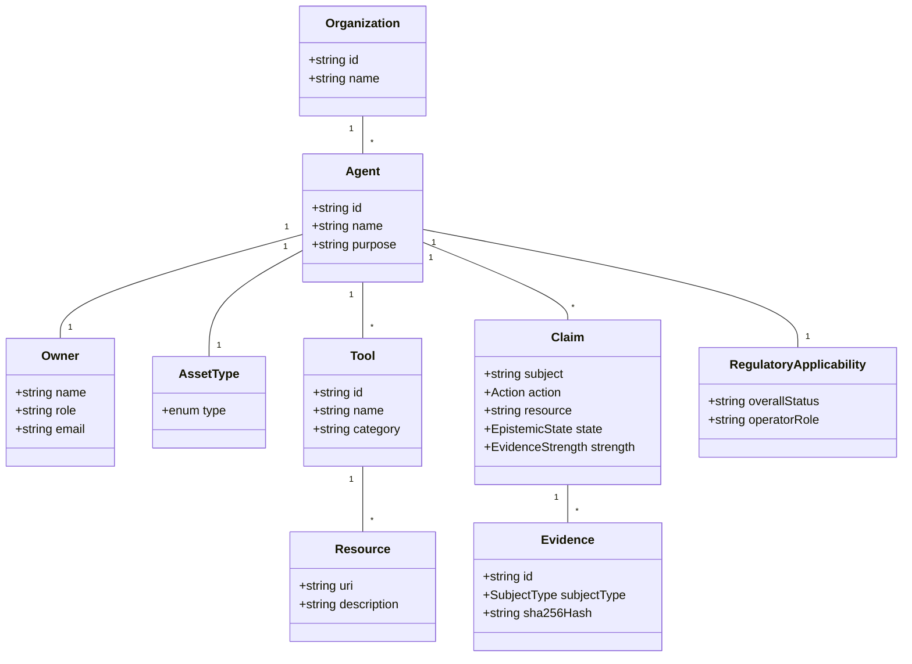
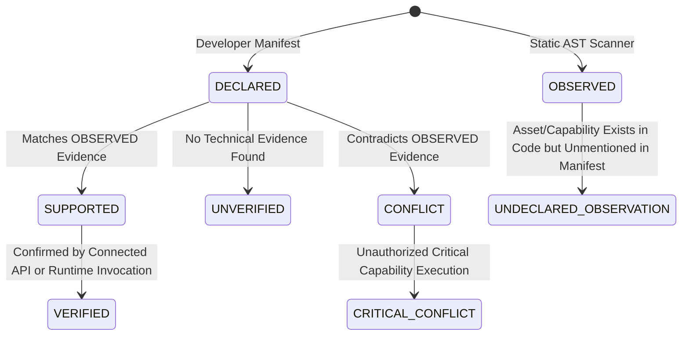

# TRUSTAGENT — ARCHITECTURE & PRODUCT RFC 01
**Title:** Open Agent Trust Manifest, Evidence Reconciliation & Open-Core Strategy  
**Author:** TrustAgent EU Architecture & Product Engineering  
**Status:** DRAFT FOR RFC DECISION  
**Date:** August 15, 2026  
**Target Version:** TrustAgent 1.0 Architecture  

---

## 1. EXECUTIVE SUMMARY

The empirical results of Sprint 03B (15 public GitHub repos) and Sprint 04 (10 holdout GitHub repos) have demonstrated a fundamental architectural truth: **Pure static code analysis cannot serve as the sole source of truth for AI agent identity, authority, or compliance.**

While static discovery achieves high recall in detecting raw AI framework signals, its precision on unseen, complex external repositories is **25%**, with a **50% Capability Precision** and a **32% Capability False Positive Rate**. Relying exclusively on static code analysis to infer what an agent *can do* leads to false claims of authority (e.g., falsely claiming `EXECUTE` or `PURCHASE` capabilities from unbound utility scripts).

This RFC establishes a new, evidence-backed architectural paradigm for TrustAgent: **Composition Over Invention**.

Instead of creating a proprietary, closed agent standard or relying blindly on raw code heuristics, TrustAgent introduces a **Claim-Centric Evidence Reconciliation Architecture**:
1. **Developer Declaration (`DECLARED`):** Expressed via a lightweight, open Minimum Useful Declaration manifest (`trustagent.yaml`) or imported from existing standards (A2A Agent Cards, MCP metadata).
2. **Static Observation (`OBSERVED`):** Extracted by an open-source, local-first scanner (`@trustagent/scanner-core`), operating fully local-first with no source code upload required.
3. **Connected Evidence (`CONNECTED`):** Verified via read-only provider APIs (GitHub, OpenAI, AWS, Anthropic).
4. **Runtime Attestation (`RUNTIME`):** Confirmed by live execution events.

TrustAgent's core value proposition is **Reconciliation & Uncertainty Management**: reconciling declarations against observed reality, detecting authority drift, flagging undeclared capabilities, and calculating audit-ready trust without overclaiming.

**RFC Final Decision:** **`GO`** (Proceed to Sprint 05 with the Composition & Overlay Architecture).

---

## 2. PROBLEM STATEMENT

As organizations deploy AI agents built with frameworks like LangChain, CrewAI, AutoGen, and Semantic Kernel, governance teams, security auditors, and regulators face critical questions:
- *What AI agents exist in our codebase and infrastructure?*
- *Who owns each agent, and who is accountable for its behavior?*
- *What tools, databases, and APIs is each agent authorized to access?*
- *Is human oversight (human-in-the-loop) or a kill-switch mechanism actually implemented?*
- *What objective evidence backs up these governance claims?*

Existing approaches fail on two fronts:
1. **Naive Self-Declarations / Questionnaires:** Static forms or manual READMEs are disconnected from technical reality, becoming outdated immediately.
2. **Pure Code Scanners:** Static AST scanners over-infer capabilities from unbound imports (e.g., inferring payment execution from a `stripe` dependency), leading to dangerous false positives.

TrustAgent solves this by creating an **open, evidence-aware reconciliation layer** that bridges developer declarations (via the experimental *TrustAgent Declaration Manifest* `trustagent.yaml`) with objective technical evidence.

---

## 3. LESSONS FROM SPRINT 03B AND SPRINT 04

The empirical progression of TrustAgent provides an irrefutable baseline:

| Metric | Sprint 03 (Synthetic) | Sprint 03B (15 Real Repos) | Sprint 04 (10 Holdout Repos) |
| :--- | :--- | :--- | :--- |
| **Agent Detection Precision** | 94.0% | 72.7% | **25.0%** |
| **Agent Detection Recall** | 100.0% | 100.0% | **66.7%** |
| **Agent Detection F1** | 96.8% | 84.2% | **36.4%** |
| **Capability Precision** | N/A | 68.0% | **50.0%** |
| **Critical `EXECUTE` FPs** | 0 | 6 | **2** |

### Key Epistemic Lessons:
1. **Static Analysis $\neq$ Source of Truth:** Static analysis is an invaluable tool for *discovery*, *bootstrap*, *contradiction detection*, and *un-declared asset discovery*, but it is insufficient to establish *authorized authority*.
2. **Potential Capability $\neq$ Agent Capability:** The presence of a `child_process.exec()` or `stripe.charges.create()` in a utility file does not mean an agent is authorized or bound to execute that capability.
3. **Declared $\neq$ Verified:** Developer manifests represent intent, not reality. TrustAgent must never blindly trust a manifest without cross-verifying against observable technical evidence.

---

## 4. RESEARCH METHOD

This RFC is based on primary technical specifications, official open-source standards, standards bodies (OWASP, OASIS, W3C, OWASP, CNCF, IETF), and empirical evaluation of real-world open-source repositories.

### Research Corpus Evaluated:
- **Agent Protocols:** Google A2A Agent Card Spec (v0.1), Anthropic Model Context Protocol Spec (2024-11-05), Microsoft Semantic Kernel Spec, OpenAI Agent Spec.
- **Supply Chain & Inventory:** OWASP CycloneDX 1.6 (ML/AI Extensions), Linux Foundation SPDX 3.0, OASIS SARIF v2.1.0, SLSA v1.0, in-toto.
- **Authorization & Identity:** CNCF SPIFFE/SPIRE, IETF GNAP (RFC 9635), UCAN v0.9, W3C Verifiable Credentials v2.0, OpenID4VC / SD-JWT VC.
- **Policy Engine:** Open Policy Agent (OPA/Rego), AWS Cedar.

---

## 5. STANDARDS LANDSCAPE ANALYSIS

To avoid reinventing existing protocols, we evaluated the global standards landscape across five domain categories:

```
+-----------------------------------------------------------------------------------+
|                            THE AGENT TRUST LANDSCAPE                              |
+--------------------------+--------------------------+-----------------------------+
|    IDENTITY & ACCESS     |  SUPPLY CHAIN / BOM      |     AGENT DESCRIPTIONS      |
|  - SPIFFE/SPIRE (CNCF)   |  - CycloneDX 1.6 (OWASP) |  - A2A Agent Cards (Google) |
|  - W3C VC / SD-JWT       |  - SPDX 3.0 (Linux Fdn)  |  - MCP Spec (Anthropic)     |
|  - GNAP / UCAN           |  - SARIF 2.1 (OASIS)     |  - OpenAI Tool Specs        |
+--------------------------+-----------------------------+--------------------------+
|               RECONCILIATION & GOVERNANCE OVERLAY (TRUSTAGENT)                    |
|  - Claim-Centric Reconciliation Engine                                            |
|  - Epistemic State Machine (DECLARED vs OBSERVED vs VERIFIED)                     |
|  - Authority Diff & Regulatory Applicability Mapping                              |
+-----------------------------------------------------------------------------------+
```

---

## 6. AGENT DISCOVERY PROTOCOLS & STANDARDS

### Evaluated Specifications:
- **Google A2A Agent Cards:** Provides JSON metadata describing agent capabilities, endpoints, and authentication schemes for Agent-to-Agent communication.
- **Anthropic Model Context Protocol (MCP):** Standardizes client-server interactions for LLMs to query tools, prompts, and resources.

### Findings:
- A2A and MCP focus on *runtime invocation and tool discovery*, not *governance, regulatory compliance, or evidence validation*.
- **Decision:** **`ADOPT`** A2A and MCP schemas as input sources for `DECLARED` and `OBSERVED` tool evidence. TrustAgent will overlay governance and authority verification on top of them.

---

## 7. AGENT IDENTITY STANDARDS

### Evaluated Specifications:
- **SPIFFE/SPIRE (CNCF):** Provides cryptographically verifiable workload identities (`spiffe://domain/ns/app`) for microservices.
- **W3C Verifiable Credentials (VC) / SD-JWT:** Provides privacy-preserving attestations.

### Findings:
- SPIFFE is ideal for machine-to-machine runtime process identity. VCs are ideal for organizational and human role attestations.
- **Decision:** **`REFERENCE`** SPIFFE IDs and W3C VCs as optional identity anchors in `trustagent.yaml`. TrustAgent will not mandate a proprietary identity scheme.

---

## 8. CAPABILITY & AUTHORITY STANDARDS

### Evaluated Specifications:
- **UCAN (User Controlled Authorization Networks):** Decentralized, capability-based delegation chains using public-key cryptography.
- **IETF GNAP (RFC 9635):** Modern authorization protocol replacing OAuth2 for rich, fine-grained capability delegation.

### Findings:
- TrustAgent is **authorization-mechanism-neutral**. Internal model relies strictly on `subject`, `action`, `resource`, `constraints`. UCAN, GNAP, OAuth, Cedar, and OPA are external authorization mechanisms that can be imported via adapters/collectors.
- **Decision:** **`REFERENCE`**. Internal capability claims use neutral tuples (`subject`, `action`, `resource`, `constraints`), avoiding mandatory adoption of UCAN or GNAP.

---

## 9. DELEGATION STANDARDS

### Evaluated Specifications:
- Delegation chains require tracking `Grantor` $\rightarrow$ `Delegate` $\rightarrow$ `Capability` $\rightarrow$ `Resource` $\rightarrow$ `Constraints` $\rightarrow$ `Revocation`.

### Findings:
- TrustAgent must support describing delegation chains regardless of whether the underlying implementation uses UCAN, OAuth tokens, or API keys.
- **Decision:** **`EXTEND`** TrustAgent's schema to include a generic `delegation` block referencing external token or key identifiers.

---

## 10. MODEL CONTEXT PROTOCOL (MCP) INTEGRATION

### Detailed Analysis:
* **What it solves:** Client-server RPC protocol for LLMs to discover tools, prompts, and resources.
* **What it does NOT solve:** Does not state who owns the tool, what human oversight exists, or whether an agent is authorized to execute destructive tool calls.
* **Overlap:** High overlap on tool definitions (`name`, `description`, `inputSchema`).
* **Decision:** **`COMPOSE`**. TrustAgent automatically parses `mcp.json` files and MCP server declarations, converting discovered tools into `OBSERVED` tool evidence linked to the host asset.

---

## 11. AGENT-TO-AGENT (A2A) AGENT CARDS INTEGRATION

### Detailed Analysis:
* **What it solves:** Agent discovery format created by Google for A2A communication.
* **What it does NOT solve:** Static code verification, evidence hashing, regulatory applicability mapping, or conflict reconciliation.
* **Decision:** **`COMPOSE`**. TrustAgent can ingest `agent-card.json` as a `DECLARED` manifest source, overlaying technical evidence checks.

---

## 12. SOFTWARE SUPPLY CHAIN & SBOM/AIBOM (CYCLONEDX / SPDX 3.0)

### Detailed Analysis:
* **CycloneDX 1.6 (ML/AI Extensions):** Standardizes Software Bill of Materials (SBOM) and Artificial Intelligence Bill of Materials (AIBOM), detailing model architectures, training datasets, and dependencies.
* **SPDX 3.0:** Linux Foundation standard for software package data and AI model metadata.
* **Decision:** **`REFERENCE`**. TrustAgent will NOT duplicate SBOM dependency trees. `trustagent.yaml` will include an optional `sbomRef` field pointing directly to an existing `cyclonedx.json` or `spdx.json`.

---

## 13. SUPPLY-CHAIN ATTESTATIONS & PROVENANCE (IN-TOTO, SLSA, SIGSTORE)

### Detailed Analysis:
* **SLSA (Supply-chain Levels for Software Artifacts) & in-toto:** Standardizes build provenance attestations.
* **Sigstore:** Cryptographic keyless signing for software artifacts.
* **Decision:** **`REFERENCE`**. TrustAgent Cloud will support verifying build provenance attestations created by in-toto/Sigstore during CI/CD pipeline scans.

---

## 14. POLICY-AS-CODE (OPA/REGO, CEDAR)

### Detailed Analysis:
* **Open Policy Agent (OPA/Rego) & AWS Cedar:** High-performance engines for evaluating authorization policies.
* **Decision:** **`COMPOSE`**. Small businesses and developers use simple YAML constraints (`approval_required: true`). Enterprise users can reference external OPA Rego or Cedar policy files (`policyRef: policies/agent_access.rego`).

---

## 15. SARIF INTEROPERABILITY

### Detailed Analysis:
* **SARIF (Static Analysis Results Interchange Format - OASIS v2.1.0):** Standard format for static analysis tools supported natively by GitHub Code Scanning, GitLab CI, and VS Code.
* **Decision:** **`ADOPT`**. `@trustagent/scanner-core` will support a native `--format sarif` flag, enabling TrustAgent findings (e.g., undeclared capabilities, secret leaks, missing owners) to render directly inside GitHub Pull Request Security tabs.

---

## 16. EXISTING COMPETING & OPEN-SOURCE TOOLS ANALYSIS

| Tool / Framework | Focus | What it Solves | What it Lacks | TrustAgent Relationship |
| :--- | :--- | :--- | :--- | :--- |
| **LangSmith / Phoenix** | Observability & Tracing | LLM prompt/completion tracing & latency | Static code audit, regulatory mapping, authority boundaries | **Integration Partner** (Runtime Evidence) |
| **AgentOps** | Agent Session Monitoring | Cost, token tracking, error replay | Supply chain verification, static authority diff, legal governance | **Integration Partner** (Runtime Evidence) |
| **AIBOM / CycloneDX** | Asset Inventory | Component/model dependency listings | Agent authority boundaries, tool capability binding, oversight gates | **Adopt / Reference** |
| **Checkov / Trivy** | IaC / Container Security | Infrastructure misconfiguration scans | Zero awareness of LLM frameworks, agent tools, or AI Act rules | **Complementary** |

---

## 17. GAP ANALYSIS MATRIX

```
+---------------------------------------------------------------------------------------------------+
|                                   THE GOVERNANCE GAP IN AI AGENTS                                 |
+-----------------------+---------------------+-----------------------+-----------------------------+
| Capability / Feature  | Observability Tools | SBOM / AIBOM Tools    | TRUSTAGENT EU               |
+-----------------------+---------------------+-----------------------+-----------------------------+
| LLM Tracing           | YES (Primary)       | NO                    | NO (Out of Scope)           |
| Model Dependency List | NO                  | YES (Primary)         | YES (Via Reference)         |
| Static AST Discovery  | NO                  | NO                    | YES (Primary)               |
| Claim Reconciliation  | NO                  | NO                    | YES (Core Value Prop)       |
| Authority Diff in CI  | NO                  | NO                    | YES (Core Value Prop)       |
| Regulatory Mapping    | NO                  | NO                    | YES (Core Value Prop)       |
+-----------------------+---------------------+-----------------------+-----------------------------+
```

---

## 18. BUILD / ADOPT / EXTEND / COMPOSE / IGNORE MATRIX

| Technology / Standard | Category | Decision | Justification |
| :--- | :--- | :--- | :--- |
| **A2A Agent Cards** | Agent Description | **COMPOSE** | Ingest as a `DECLARED` input source. Do not create a competing card format. |
| **Model Context Protocol (MCP)**| Tool Discovery | **COMPOSE** | Ingest `mcp.json` as `OBSERVED` tool evidence. |
| **CycloneDX 1.6 AIBOM** | Asset Inventory | **REFERENCE** | Reference external SBOM files rather than duplicating dependency trees. |
| **SARIF v2.1.0** | CI/CD Reporting | **ADOPT** | Native output format for GitHub/GitLab security integrations. |
| **UCAN / GNAP** | Authorization Scheme| **ADOPT** | Use capability tuple design (`subject`, `action`, `resource`, `constraint`). |
| **SPIFFE / SPIRE** | Process Identity | **REFERENCE** | Optional workload identity reference. |
| **W3C VC / SD-JWT** | Verifiable Identity | **REFERENCE** | Optional organizational identity anchor for enterprise attestations. |
| **Open Policy Agent (Rego)** | Policy-as-Code | **COMPOSE** | Allow optional reference to external Rego policies for enterprise rules. |
| **Proprietary Identity Standard**| Identity | **IGNORE** | Do not invent custom crypto identity schemes. Reuse existing standards. |

---

## 19. PROPOSED TRUSTAGENT CONCEPTUAL MODEL

The conceptual domain model of TrustAgent contains 16 core entities:



---

## 20. CLAIM-CENTRIC MODEL (`CLAIM` AS FUNDAMENTAL PRIMITIVE)

In TrustAgent, the fundamental atomic unit of evaluation is the **`CLAIM`**, not merely the `AGENT`.

### Claim Definition Structure:
```typescript
interface Claim {
  id: string;
  subject: string;                // e.g. "agent:invoice-processor"
  predicate: "CAN" | "MUST" | "CANNOT";
  action: "READ" | "WRITE" | "CREATE" | "UPDATE" | "DELETE" | "EXECUTE" | "SEND" | "PUBLISH" | "APPROVE" | "PURCHASE" | "TRANSFER" | "ADMIN";
  resource: string;               // e.g. "resource:stripe.invoices"
  constraint: string;             // e.g. "amount < 500 EUR && human_approval == true"
  epistemicState: EpistemicState; // DECLARED, OBSERVED, SUPPORTED, VERIFIED, CONFLICT, UNVERIFIED
  evidenceStrength: EvidenceStrength;
  confidence: number;
  provenance: {
    file: string;
    lineRange?: string;
    snippet?: string;
  };
}
```

---

## 21. EVIDENCE MODEL & PROVENANCE CHAIN

All claims must link to one or more **Evidence Records**. Evidence records are immutable, sanitized, and cryptographically hashed using SHA-256.

$$\text{EvidenceHash}_n = \text{SHA256}(\text{SanitizedPayload}_n + \text{PreviousHash}_{n-1})$$

```
+-------------------+      +-------------------+      +-------------------+
|  Evidence Ev-01   |      |  Evidence Ev-02   |      |  Evidence Ev-03   |
|  Subject: CONNECTOR|      |  Subject: AGENT   |      |  Subject: TOOL    |
|  Scope: PERMISSION|      |  Scope: AUTHORITY |      |  Scope: ACCESS    |
|  Hash: 4f21b...   |----->|  Previous: 4f21b..|----->|  Previous: 1768d..|
|                   |      |  Hash: 1768d...   |      |  Hash: 9a81c...   |
+-------------------+      +-------------------+      +-------------------+
```

---

## 22. EPISTEMIC STATE MACHINE & VALIDATION AXIOMS

TrustAgent enforces strict mathematical and logical boundaries on claim states:



### Core Validation Axioms (Inviolable Rules):
$$\text{DECLARED} \neq \text{VERIFIED}$$
$$\text{OBSERVED} \neq \text{AUTHORIZED}$$
$$\text{IMPLEMENTED} \neq \text{ENABLED}$$
$$\text{ENABLED} \neq \text{EXECUTED}$$
$$\text{EXECUTED} \neq \text{AUTHORIZED}$$
$$\text{AUTHORIZED} \neq \text{COMPLIANT}$$

---

## 23. AUTHORITY MODEL & IMPLEMENTED VS AUTHORIZED DIFFERENTIATION

A critical cause of static analysis false positives is confusing *implemented functions* with *authorized capabilities*.

```
+-----------------------------------------------------------------------------------+
|                                 AUTHORITY STACK                                   |
+-----------------------------------------------------------------------------------+
| [5] EXECUTED CAPABILITY   | Invoked at runtime by live agent (Runtime Log)        |
+---------------------------+-------------------------------------------------------+
| [4] AUTHORIZED CAPABILITY | Granted by human owner via manifest + policies        |
+---------------------------+-------------------------------------------------------+
| [3] AGENT-BOUND TOOL      | Registered inside agent instance tool list            |
+---------------------------+-------------------------------------------------------+
| [2] IMPLEMENTED FUNCTION  | Function exists in source code / utility file          |
+---------------------------+-------------------------------------------------------+
| [1] DEPENDENCY INSTALLED  | Package present in package.json / requirements.txt    |
+-----------------------------------------------------------------------------------+
```

* **Rule:** Static discovery can prove Level 1 and Level 2, and infer Level 3. **Static discovery CANNOT claim Level 4 (Authorized) or Level 5 (Executed) without connected/runtime evidence.**

---

## 24. RECONCILIATION ENGINE ARCHITECTURE & CONFLICT RESOLUTION RULES

The Reconciliation Engine is the core algorithmic component of TrustAgent. It takes input from multiple independent evidence channels and computes reconciled claim states:

```typescript
export class ReconciliationEngine {
  public static reconcile(declaredClaims: Claim[], observedClaims: Claim[]): ReconciledResult {
    const reconciledClaims: Claim[] = [];
    const conflicts: ConflictReport[] = [];

    for (const dClaim of declaredClaims) {
      const match = observedClaims.find(o => o.action === dClaim.action && o.resource === dClaim.resource);
      if (match) {
        reconciledClaims.push({
          ...dClaim,
          epistemicState: 'SUPPORTED',
          confidence: Math.min(dClaim.confidence, match.confidence),
          evidenceStrength: match.evidenceStrength
        });
      } else {
        reconciledClaims.push({
          ...dClaim,
          epistemicState: 'UNVERIFIED',
          confidence: 0.4
        });
      }
    }

    for (const oClaim of observedClaims) {
      const declaredMatch = declaredClaims.find(d => d.action === oClaim.action && d.resource === oClaim.resource);
      if (!declaredMatch) {
        reconciledClaims.push({
          ...oClaim,
          epistemicState: 'UNDECLARED_OBSERVATION',
          confidence: oClaim.confidence
        });
      }
    }

    return { reconciledClaims, conflicts };
  }
}
```

---

## 25. MANIFEST DESIGN & MINIMUM USEFUL DECLARATION (MUD)

To achieve high developer adoption, `trustagent.yaml` must follow the **Minimum Useful Declaration (MUD)** principle: short, clear, and human-readable.

---

## 26. EXAMPLE MINIMAL MANIFEST (`trustagent.yaml`)

```yaml
version: "1.0"
agent:
  id: "customer-support-agent"
  name: "Customer Support Assistant"
  purpose: "Handles tier-1 customer inquiries and retrieves order status"
  owner:
    name: "DevOps Team"
    email: "devops@company.com"

capabilities:
  - action: READ
    resource: "database:orders"
  - action: SEND
    resource: "email:customer"
    constraint: "template == 'order_status'"

oversight:
  human_in_the_loop: true
  revocation_mechanism: "environment_flag:DISABLE_AGENT"
```

---

## 27. EXAMPLE ADVANCED MANIFEST (MULTI-AGENT, MONOREPO, DELEGATIONS)

```yaml
version: "1.0"
metadata:
  org_id: "org-enterprise-01"
  project: "finance-monorepo"

agents:
  - id: "invoice-agent"
    name: "Invoice Processing Agent"
    asset_type: "AGENT"
    framework: "LangGraph"
    provider: "OpenAI"
    model: "gpt-4o"
    owner:
      name: "Finance Engineering Team"
      email: "fin-eng@company.com"
    capabilities:
      - action: READ
        resource: "postgres:invoices"
      - action: PURCHASE
        resource: "api:stripe"
        constraint: "amount <= 500 EUR"
    oversight:
      human_in_the_loop: true
      approval_required: "amount > 500 EUR"
      revocation_mechanism: "api_call:POST /agent/stop"
    external_references:
      sbom: "file:cyclonedx.json"
      mcp_server: "file:mcp.json"

  - id: "audit-agent"
    name: "Read-Only Compliance Auditor"
    asset_type: "AGENT"
    framework: "CrewAI"
    provider: "Anthropic"
    owner:
      name: "Compliance Officer"
      email: "compliance@company.com"
    capabilities:
      - action: READ
        resource: "all_resources"
```

---

## 28. MULTI-AGENT & MONOREPO SUPPORT ARCHITECTURE

TrustAgent rejects the naive assumption `repository == 1 agent`.
A single repository (or monorepo) may contain:
- Multiple distinct AI agents.
- Shared tool servers (e.g., MCP servers).
- Shared vector stores.
- Utility libraries.

`trustagent.yaml` supports an `agents:` array, matching multi-agent architectures explicitly.

---

## 29. TRUSTAGENT AUTHORITY DIFF SPECIFICATION

The **TrustAgent Authority Diff** is a key feature for CI/CD pipelines. It compares the reconciled authority graph of `Commit A` vs `Commit B` and flags authority expansion:

```
+-----------------------------------------------------------------------------------+
|                        TRUSTAGENT AUTHORITY DIFF (PR #142)                         |
+-----------------------------------------------------------------------------------+
| [NEW ASSET]       + agent:refund-agent (AssetType: AGENT)                         |
| [EXPANDED ACTION] + agent:invoice-agent CAN PURCHASE on api:stripe (amount <= 5k) |
| [REMOVED CONTROL] - agent:invoice-agent human_approval_required REMOVED           |
| [WARNING]         CRITICAL AUTHORITY EXPANSION DETECTED IN PULL REQUEST           |
+-----------------------------------------------------------------------------------+
```

---

## 30. CI/CD EXPERIENCE & DEVELOPER WORKFLOW

Developers interact with TrustAgent via a simple, fast CLI interface:

```bash
# 1. Initialize draft manifest from static codebase scan
npx @trustagent/cli init

# 2. Run local scan & generate structured report
npx @trustagent/cli scan .

# 3. Validate codebase against declared trustagent.yaml
npx @trustagent/cli validate . --strict

# 4. Generate SARIF report for GitHub Code Scanning tab
npx @trustagent/cli scan . --format sarif --output trustagent.sarif

# 5. Compute authority diff between git HEAD and main branch
npx @trustagent/cli diff origin/main..HEAD
```

---

## 31. DETECTOR & PLUGIN ARCHITECTURE

To support new frameworks without modifying the core scanner, TrustAgent exposes a **Plugin API**:

```typescript
export interface TrustAgentPlugin {
  id: string;
  name: string;
  supportedLanguages: string[];
  detect(context: ScanContext): Promise<EvidenceRecord[]>;
}
```
* **Rule:** Plugins emit `EvidenceRecord[]`. Plugins **do not** write final claims. The Reconciliation Engine processes all plugin evidence centrally.

---

## 32. LOCAL-FIRST PRIVACY & ZERO-KNOWLEDGE CODE SCANNER BOUNDARY

`@trustagent/scanner-core` is **100% local-first**.
- Zero source code is uploaded to TrustAgent Cloud.
- Only sanitized cryptographic evidence hashes, claim summaries, and metadata are transmitted to TrustAgent Cloud if the user explicitly connects their project.

---

## 33. OPEN-SOURCE SCANNER CORE BOUNDARY (`@trustagent/scanner-core`)

```
+-----------------------------------------------------------------------------------+
|                        TRUSTAGENT OPEN-CORE BOUNDARY                              |
+----------------------------------------------------+------------------------------+
| @trustagent/scanner-core (Open Source / MIT)       | TrustAgent Cloud (SaaS/Comm) |
+----------------------------------------------------+------------------------------+
| - AST Code Scanner                                 | - Multi-tenant SaaS          |
| - AI Estate Taxonomy Classifier                    | - Continuous GitHub App Scans|
| - Local trustagent.yaml Validator                  | - Hosted Evidence Retention  |
| - SARIF Export Generator                           | - Regulatory Applicability   |
| - Git Authority Diff Engine                        | - Executive Dashboards       |
| - Local JSON / CLI Output                          | - Team & Role Management     |
+----------------------------------------------------+------------------------------+
```

---

## 34. LICENSING STUDY & RECOMMENDATION

### License Comparison:
- **MIT / Apache-2.0:** Maximum developer adoption, zero friction for enterprise integration. Permissive.
- **AGPL-3.0 / BUSL:** Protects against SaaS copycats but creates severe friction in enterprise developer adoption.

### Recommendation:
* **`@trustagent/scanner-core` & CLI:** **`Apache 2.0`** (Permissive, enterprise-friendly, builds developer ecosystem trust).
* **TrustAgent Cloud Platform:** **`Proprietary Commercial License`**.

---

## 35. COMMERCIAL BOUNDARY & TRUSTAGENT CLOUD ARCHITECTURE

TrustAgent Cloud acts as the **centralized compliance & governance control plane**. It ingests evidence attestations from local CLI runs, GitHub Actions, and hosted provider API connectors, presenting continuous compliance dashboards for auditors.

---

## 36. COMMERCIAL MODEL & PRICING TIERS

1. **Community Tier (Free / Open Source):** `@trustagent/scanner-core` CLI, local scans, SARIF generation, local authority diffs.
2. **Pro Tier ($49/month):** Hosted history, single-team dashboard, GitHub App automated PR checks, 30-day evidence retention.
3. **Business Tier ($499/month):** Continuous connected evidence (GitHub + OpenAI + AWS APIs), multi-team, automated EU AI Act applicability mapping, executive reports.
4. **Enterprise Tier (Custom):** Dedicated instance, SAML/SSO, custom Rego policies, audit readiness advisory, SLA.

---

## 37. SHORT-TERM REVENUE PATH (LOW CAPITAL BOOTSTRAP STRATEGY)

With zero initial capital, TrustAgent can generate immediate revenue **before building complex runtime connectors**:
1. **Technical Trust & Authority Audits ($1,500 - $5,000 per audit):** Offer manual/semi-automated AI Agent Authority Audits for automation agencies deploying AI agents for client SMEs.
2. **CI/CD Security Check Integration:** Sell Pro SaaS subscriptions to startups needing automated PR authority checks.

---

## 38. REGULATORY INTEGRATION & SEPARATION OF TECHNICAL VS LEGAL TRUST

TrustAgent maintains a strict architectural wall between **Technical Evidence** and **Legal Applicability**:

```
+-----------------------------------------------------------------------------------+
|                        REGULATORY LAYER SEPARATION                                |
+-----------------------------------------------------------------------------------+
| [LAYER 3: REGULATORY APPLICABILITY] EU AI Act Art 50 / High Risk Annex III        |
|                                       ^ Consumes Compliance Status                |
| [LAYER 2: GOVERNANCE & CONTROLS]     8 Critical Gates / Trust Governance Status   |
|                                       ^ Consumes Reconciled Claims                |
| [LAYER 1: TECHNICAL EVIDENCE]         Cryptographic Evidence Hashes SHA-256         |
+-----------------------------------------------------------------------------------+
```

---

## 39. EUDI WALLET & EIDAS 2.0 RELEVANCE & BOUNDARIES

### Evaluation:
* EUDI Wallets and eIDAS 2.0 provide verifiable organizational identity and qualified electronic seals (`QSeal`).
* **Decision:** **`FUTURE / REFERENCE`**. In Enterprise scenarios, TrustAgent Cloud will support signing compliance attestations using eIDAS Qualified Seals.

---

## 40. FUTURE RUNTIME LAYER ROADMAP

```
+-----------------------------------------------------------------------------------+
|                           EVOLUTIONARY ROADMAP                                    |
+-----------------------------------------------------------------------------------+
| LEVEL 1: STATIC DISCOVERY     | Scanner Core AST & Manifest Validation (Sprint 04)|
| LEVEL 2: CONNECTED EVIDENCE   | Read-only API verification (GitHub, OpenAI, AWS) |
| LEVEL 3: RUNTIME ATTESTATION  | Live execution event tracing & agent proxies      |
| LEVEL 4: ENFORCEMENT & KILL-SW| Active runtime interception & kill-switch execution|
+-----------------------------------------------------------------------------------+
```

---

## 41. ARCHITECTURAL NOTE: ANARQ INTEROPERABILITY POINTS

* **Private Strategy Note:** TrustAgent is 100% standalone and independent. However, its Claim & Evidence schemas (`subject`, `action`, `resource`, `sha256Hash`) are structured so that if interoperability with AnarQ protocols (e.g. Qerberos audit logs or sQuid identities) is desired in the future, it can be accomplished via zero-cost adapter interfaces.

---

## 42. THREAT MODEL & FALSE MANIFEST RESISTANCE

### Threat Scenario:
A malicious developer submits a false `trustagent.yaml` claiming `human_in_the_loop: true` and `capabilities: []` while the code executes unauthorized `DELETE` operations.

### Defense Mechanism:
1. TrustAgent **never** sets claim status to `VERIFIED` based on a manifest alone.
2. A manifest without code evidence produces `epistemicState = UNVERIFIED`.
3. Code executing un-declared capabilities produces `epistemicState = UNDECLARED_OBSERVATION` or `CONFLICT`.
4. Auditors see explicit flags: *"Manifest claims zero capabilities, but static code scanner observed executable shell bindings (CONFLICT)."*

---

## 43. RISK ANALYSIS & MITIGATION STRATEGIES

| Risk | Impact | Likelihood | Mitigation Strategy |
| :--- | :--- | :--- | :--- |
| Developer resistance to writing YAML | High | Medium | Provide `npx @trustagent/cli init` to auto-generate draft manifests. |
| AST Scanner missing custom frameworks | Medium | High | Expose Plugin API for community framework detectors. |
| False positive noise in CI/CD | High | High | Enforce strict critical capability policy (`UNKNOWN` > False `EXECUTE`). |

---

## 44. ALTERNATIVES REJECTED & RATIONALE

1. **Rejected Alternative 1: Building a New Closed Agent Card Format.**  
   *Rationale:* Competing with Google A2A or Anthropic MCP creates ecosystem fragmentation. Composing over existing formats is superior.
2. **Rejected Alternative 2: Relying 100% on Static AST Scanning.**  
   *Rationale:* Refuted by Sprint 04 empirical holdout metrics (25% precision).
3. **Rejected Alternative 3: Requiring AGPL-3.0 Copyleft Licensing for Scanner Core.**  
   *Rationale:* Destroys developer adoption in enterprise environments. Apache 2.0 is selected.

---

## 45. RFC DECISION MATRIX

| Criteria | Option A (Proprietary Manifest) | Option B (Existing Specs Only) | Option C (Profile of Existing Spec) | Option D (Composition & Evidence Overlay) |
| :--- | :--- | :--- | :--- | :--- |
| **Developer Adoption** | Low | High | Medium | **High** |
| **Interoperability** | Low | High | Medium | **High** |
| **Evidence Aware** | No | No | Partial | **YES (Primary)** |
| **Regulatory Mapping** | No | No | No | **YES (Primary)** |
| **Implementation Cost** | High | Low | Medium | **Medium** |
| **COMMERCIAL VALUE** | Low | Low | Low | **HIGH (Unique Positioning)** |

* **Winner:** **Option D (Composition & Evidence Overlay Architecture)**.

---

## 46. RECOMMENDED ARCHITECTURE (COMPOSITION & EVIDENCE OVERLAY)

TrustAgent will position itself as the **universal evidence & governance overlay for AI agents**. It ingests declarations from A2A, MCP, and `trustagent.yaml`, overlays observations from `@trustagent/scanner-core`, reconciles conflicts, and maps evidence to regulatory requirements.

---

## 47. RECOMMENDED MINIMUM VIABLE PRODUCT (MVP)

1. **`@trustagent/scanner-core` (npm package):** AST engine, AI Estate Classifier, SARIF exporter.
2. **`trustagent.yaml` Specification:** Lightweight MUD schema for developer agent declarations.
3. **Reconciliation Engine (CLI + Core):** Matches manifest declarations against AST observations.
4. **Git Authority Diff:** CLI command `npx @trustagent/cli diff` for Pull Requests.

---

## 48. WHAT NOT TO BUILD IN SPRINT 05

- **DO NOT BUILD:** Hosted SaaS web UI or complex databases.
- **DO NOT BUILD:** Runtime monitoring proxies or live eIDAS/EUDI signing infrastructure.
- **DO NOT BUILD:** Proprietary identity protocols or custom crypto schemes.

---

## 49. PROPOSED SPRINT 05 SCOPE

* **Name:** *Sprint 05 — Open Core Scanner & Evidence Reconciliation Engine*
* **Deliverables:**
  1. Extract `@trustagent/scanner-core` package with zero SaaS dependencies.
  2. Implement `trustagent.yaml` MUD parser & validator.
  3. Implement the `ReconciliationEngine` (reconciling manifest vs AST observations).
  4. Implement native SARIF exporter for GitHub Code Scanning.
  5. Implement `npx @trustagent/cli diff` for Git commit authority comparison.
  6. Execute regression benchmark against Development (15 repos) and Holdout (10 repos) Corpora.

---

## 50. FORMAL RFC DECISION

# **`GO`**

**Approved for Execution:** Proceed to Sprint 05 with Option D (*Composition & Evidence Overlay Architecture*), extracting `@trustagent/scanner-core` and building the Open-Core Reconciliation Engine.

---

*RFC 01 Architecture & Product Specification complete.*
