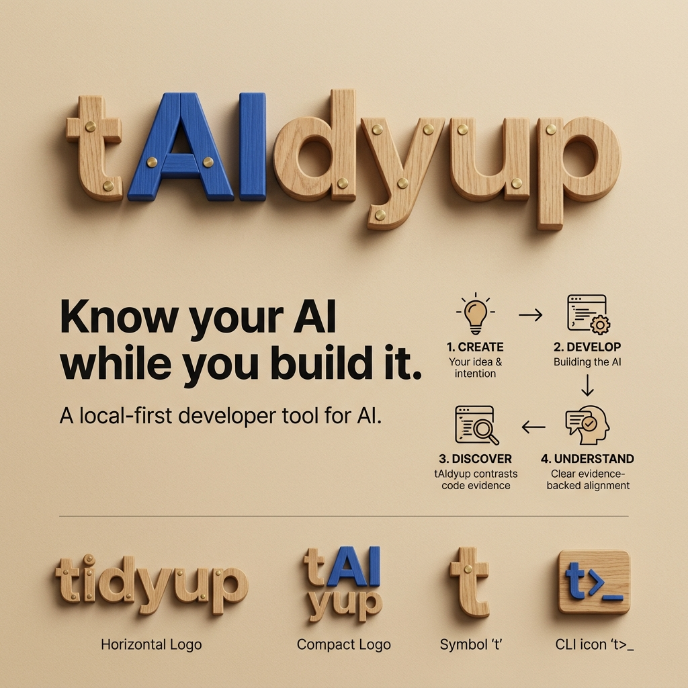

# tAIdyup — Canonical Brand Identity & Messaging Architecture

> **"Know your AI while you build it."**

---

## 🎯 Canonical Brand Messaging Architecture

### Primary Tagline
`Know your AI while you build it.`

### Full Product Descriptor
`The local-first developer tool for understanding, checking and evidencing what your AI can actually do.`

### Short Visual Descriptor
`A local-first developer tool for AI.`

### Supporting Functional Message
`Align what you declare with what you build.`

*(Note: The supporting functional message is used in feature explanations, diagrams, and product copy, but is not the primary brand tagline).*

---

## 🏗️ Developer-First Positioning Hierarchy

1. **Developer Tool for AI Projects:** Used during active AI development.
2. **Understand While Building:** Enables developers to know what their AI system is becoming while coding.
3. **Observe, Contrast & Reconcile:** Reconciles declared intent against AST code evidence.
4. **Provenance & Evidence Generation:** Exports audit-ready technical passports, JSON reports, and SARIF static analysis output.
5. **Delivery, Governance & Compliance Workflows:** Supports PR code reviews, client handoffs, and regulatory compliance disclosures as natural downstream outcomes.

---

## 🪵 Canonical Pinocchio Metaphor: Creation, Development, Discovery & Understanding

Like Pinocchio, your AI begins as something you create with intention. As it develops and encounters the real world, what it has become may not perfectly match what was originally understood or declared. tAIdyup helps make that distance visible, contrast intention with technical evidence, and help the developer understand what they have actually built.

### The Canonical Progression
1. **CREATE (CREAS):** Your idea and your intention.
2. **DEVELOP (DESARROLLAS):** Shaping and building the AI system.
3. **DISCOVER (CONTRASTAS):** tAIdyup contrasts expectation/declaration with observable AST code evidence.
4. **UNDERSTAND (CONOCES):** Deep evidence-backed knowledge of what you built, where alignment exists, and where attention is needed.

---

## 📏 The Nose as a Metaphor for Distance (Not Dishonesty)

- **Distance (Observable Gap):** When there is distance between what is declared/expected and what technical code evidence shows, that distance becomes visible. The nose represents that **observable gap**, never dishonesty, deception, or an accusation.
- **Alignment:** When declaration, expectation, and technical evidence correspond, the distance disappears. The result is not "the developer was telling the truth", but rather: **the developer has better evidence-backed knowledge of what they built**.

---

## 🛡️ Product Epistemic Principle

tAIdyup **observes**.  
tAIdyup **contrasts**.  
tAIdyup **reconciles evidence**.  
tAIdyup **surfaces discrepancies**.  
tAIdyup **helps developers understand their AI systems**.

tAIdyup **does NOT** infer intent.  
tAIdyup **does NOT** accuse developers of lying or deception.  
tAIdyup **does NOT** convert technical observations into moral judgments.  
tAIdyup **does NOT** automatically make legal compliance determinations.

Coherent with the 5 epistemic states:
`SUPPORTED` · `UNVERIFIED` · `CONFLICT` · `UNDECLARED_OBSERVATION` · `UNKNOWN`

---

## 🎨 Canonical Brand Assets Directory

The official public brand assets reside in [docs/assets/brand/](assets/brand/):

* **Primary Logo:** [taidyup-logo.png](assets/brand/taidyup-logo.png)
* **Symbol Mark:** [taidyup-mark.png](assets/brand/taidyup-mark.png)
* **Presentation Board:** [taidyup-brand-identity-canonical.png](assets/brand/taidyup-brand-identity-canonical.png)
* **Original Presentation Artwork:** [taidyup_brand_identity_canonical.jpg](assets/brand/taidyup_brand_identity_canonical.jpg)
